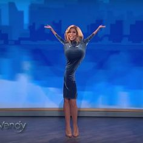

# My First Coding Assignment

## About Me
Certified silly goose: always cracking jokes and bringing levity to any situation. Naturally, I love puns and with a last name like mine, they thrive at the grocery store (I'm a real "cereal" killer when it cosmes to bad jokes).

My hobbies include messing with my frenchie (named after Lilo from Lilo and Stitch), burning down kitchens through my fun attempts at cooking, getting lost in new cities/places with my complete disregard for direction,  reading or at least attempting to and spending too much time switching outfits to go to coffee shops. 

## Past Coding Experience
Absolutely none! This class will be both extermely challegnging and equally as fulfilling for me as I learn the basics of how to code websites. I work as an Integrated Producer at an advertising agency and one of my strong suits is running web projects; I figured this would be interesting to look at the other side of web work as I deal predominately with the front end. 
## Career Goals
1. Change careers from advertising into teaching 
2. Start my own small business by the age of 30
3. Build a digital business grounded in a community-based podcast
4. Earn a PhD to become a professor by the age of 35